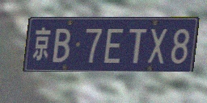
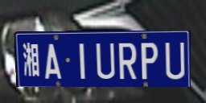
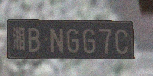
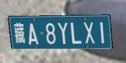
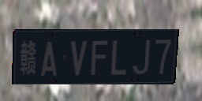

# generate_car_plate

```
生成车牌识别/OCR识别训练数据
generate Car Plate dataset for PR/OCR training
国内蓝色普通车牌生成，忘了参考过哪里的代码，其他类型牌照参考一下按随意
```
 





## todo：

```
1.增加全类型(新能源 特殊车辆等)
2.背景更真实
3.还没想好，可能顺便重构一下
```
## workflow：
```
1.把生成的字符串写到蓝色车牌模版照片上，生成车牌；
2.把车牌照片放到背景照片上；
3.增加旋转、噪声，参见 def generate（）
```
## use：
```
python genCarPlate.py 100
```
## param：
```
--每个省份生成车牌图像数量：gen_count_per_province=随意
--根据自己的训练要求，图像大小即背景照片(Background/)设置为了256*128，按需随意
--为了使得车牌占比约为80% 设置车牌大小为(220, 70)，按需随意
```
## license：
```
没有，拿去随便造作
```
